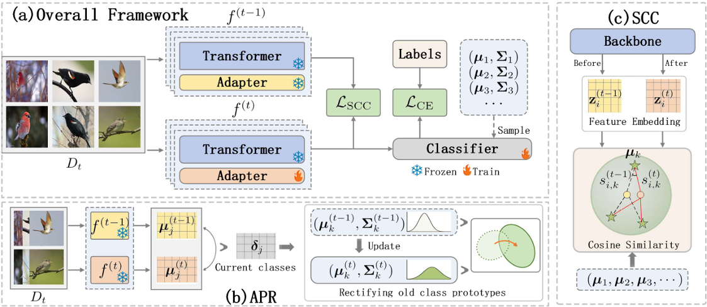

# Exemplar-Free Class Incremental Learning via Preserving Class-Discriminative Structure

<div align="center">

<div>
    <a href='' target='_blank'>Xin Zhang</a><sup>1</sup>&emsp;
    <a href='' target='_blank'>Liang Bai</a><sup>1,*</sup>&emsp;
    <a href='' target='_blank'>Guanchao Wang</a><sup>1</sup>&emsp;
    <a href='' target='_blank'>Xian Yang</a><sup>2</sup>
</div>
<div>
<sup>1</sup>Institute of Intelligent Information Processing, Shanxi University, Taiyuan 030006, China&emsp;
<sup>2</sup>Alliance Manchester Business School, The University of Manchester, Manchester M13 9PL, United Kingdom
</div>
<div>
<sup>*</sup>Corresponding author
</div>
</div>

The code repository for "Exemplar-Free Class Incremental Learning via Preserving Class-Discriminative Structure" in PyTorch. 

## News

- [03/2026] The paper has been accepted by **CVPR 2026**.

## Abstract

Class-incremental learning (CIL) aims to enable models to continuously learn new classes while overcoming catastrophic forgetting. The emergence of large-scale pre-trained models, such as Vision Transformers (ViTs), has transformed the landscape of visual recognition. However, existing approaches overlook a crucial cause of catastrophic forgetting: the collapse of the class-discriminative structure, which comprises intra-class structure (characterizing the shape of individual classes) and inter-class structure (characterizing global geometric relationships among class prototypes).

To address these challenges, we propose a unified framework designed to maintain this structure through two complementary mechanisms:
- **Adaptive Prototype Rectification (APR)**: Dynamically corrects old class prototypes by propagating displacement patterns from new prototypes to preserve the intra-class structure.
- **Structural Consistency Constraint (SCC)**: A lightweight constraint that preserves inter-class structure by stabilizing the relationships between new task samples and old prototypes.

Extensive experiments demonstrate that our framework outperforms existing leading methods on multiple EFCIL benchmarks, validating that preserving the class-discriminative structure is crucial for mitigating catastrophic forgetting.

## Pipeline

<div align="center">

</div>

## Requirements

### Dependencies

Create the conda environment using the provided `cds.yaml`:

```bash
conda env create -f cds.yaml
conda activate cds
```

Or install the key dependencies manually:
- Python 3.9.19
- [PyTorch 2.4.1](https://pytorch.org/)
- [torchvision 0.19.1](https://github.com/pytorch/vision)
- [timm 0.6.12](https://github.com/huggingface/pytorch-image-models)
- numpy, scipy, pillow, tqdm, pyyaml

## Training

Run the main script:

```bash
python main.py
```

## Citation


